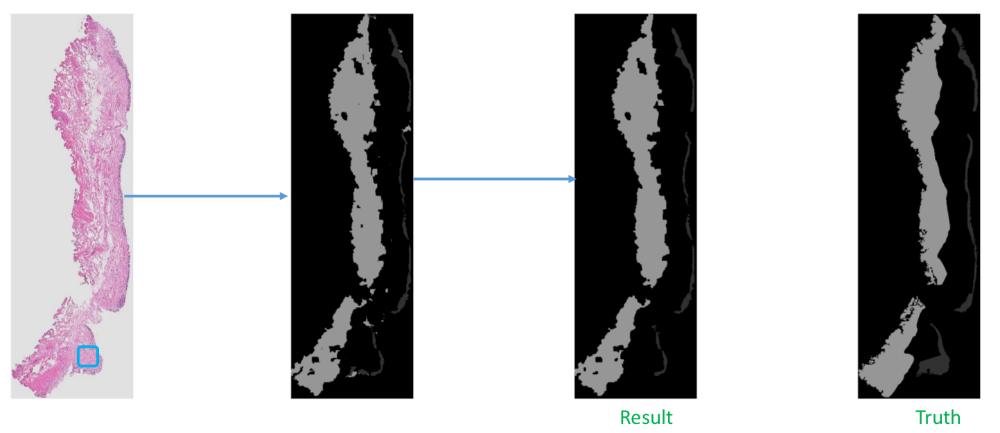
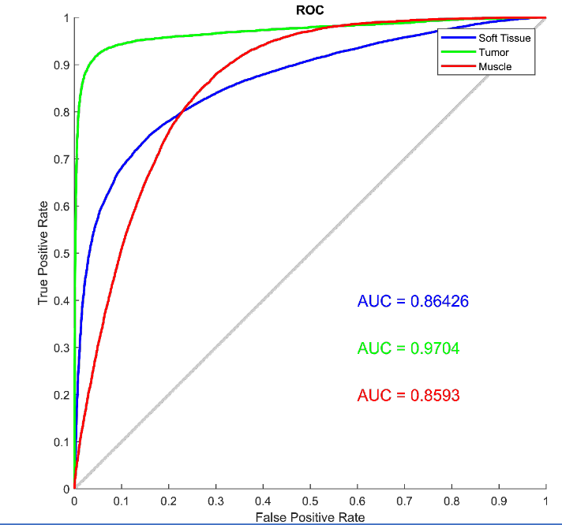
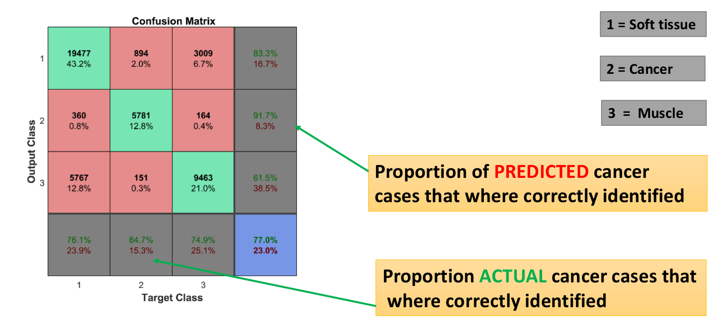

# Bladder-Tissue-Classification-using-CNN

Implemented and trained convolutional neural network(CNN) from scratch using matlab and keras with tensorflow
back-end to classify bladder pathology image regions into soft tissue, muscle, and tumor. Applied patch based classification as size of pathology images is very large. Evaluated CNN and CNN + Support Vector Machine(SVM)

The implemetation has MATLAB and Python version. MATLAB implemetation is tested in version 2016b, while python version is tested in python3.6 and 

## Libraries for python code
The code has been tested with the following configuration

- keras == 2.1.2
- python == 3.6
- scipy == 0.19.0
- sckit-learn == 0.18.1
- tensorflow == 1.4.1
- tensorflow-gpu == 1.4.1

## Libraries for matlab code
The code has been tested with the following configuration

-matlab2016

-[matconvnet24](http://www.vlfeat.org/matconvnet/)

## How to run it
Once all the libraries above have been installed, download the files and run them.

## sample output

## Dice index evaluation

## ROC Curve 

## Confusion matrix

